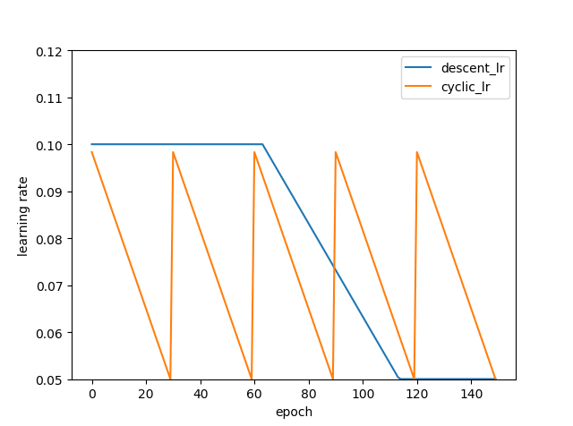

# Stochastic Weight Averaging (SWA)
This repository contains a keras implementation of the Stochastic Weight Averaging (SWA) training method for DNNs from the paper

[Averaging Weights Leads to Wider Optima and Better Generalization](https://arxiv.org/abs/1803.05407)

by Pavel Izmailov, Dmitrii Podoprikhin, Timur Garipov, Dmitry Vetrov and Andrew Gordon Wilson.

# Introduction

SWA is a simple DNN training method that can be used as a drop-in replacement for SGD with improved generalization, faster convergence, and essentially no overhead. The key idea of SWA is to average multiple samples produced by SGD with a modified learning rate schedule. Use a constant or cyclical learning rate schedule that causes SGD to _explore_ the set of points in the weight space corresponding to high-performing networks. SWA converges more quickly than SGD, and to wider optima that provide higher test accuracy. 

<p align="center">
  
  
  
</p>

# Dependencies
* [keras](https://github.com/keras-team/keras)
* [tensorflow](https://github.com/tensorflow/tensorflow)

## Learning Rate Policy


## Tutorials
lr_schedule.py contains learing rate change policy which works with keras `LearningRateScheduler`
```python
from lr_schedule import LR_schedule
from keras.callbacks import LearningRateScheduler
swa_start = ... # the number of epoch after which SWA will start to average models
lr_start = ... # initial learning rate
lr_end = 0.04 # SWA learning rate 
training_epochs = ...
batch_size = ...
c= ... # the cycle period

# cyclic learning rate
schedule = lambda epoch: LR_schedule(epoch, flag=True, SWA_START=swa_start, lr_start=lr_start, lr_end=lr_end, c=c)
lr_schedule_obj = LearningRateScheduler(schedule=schedule)

# descent learing rate
schedule = lambda epoch: LR_schedule(epoch, SWA_START=swa_start, lr_start=lr_start, lr_end=lr_end)
lr_schedule_obj = LearningRateScheduler(schedule=schedule)
```
swa.py contains an implementation for stochastic weight averaging (SWA). 
Callback is instantiated with filename for saving the final weights of the model after SWA and the number of epochs to average.

e.g. total number of training epochs 150, SWA to start from epoch 140 to average last 10 epochs.
```python
from swa import SWA
swa_obj = SWA('./model_dumps/',swa_start)
model_swa = ...
model_swa.fit(X_train, y_train,callbacks=[lr_schedule_obj,swa_obj],validation_data=(X_test, y_test),epochs=training_epochs,batch_size=batch_size)

#  constant learning rate
model_swa.fit(X_train, y_train,callbacks=[swa_obj],validation_data=(X_test, y_test),epochs=training_epochs,batch_size=batch_size)
```
## Example
- Multilayer Perceptron ([SWA_MLP_MNIST.ipynb](https://github.com/xuyiqiang-learn/SWA_keras/blob/master/SWA_MLP_MNIST.ipynb))

## Result
The mnist example is relatively simple and does not give full play to SWA's advantages.  SWA has great potential for scenes with large amount of data and sparse features.  In this scenario, there is obvious fluctuation in the training results of different data shuffles. SWA, an ensemble method, can get a stable high-quality model.
# References
 * [Stochastic Weight Averaging in PyTorch](https://github.com/timgaripov/swa)
 


